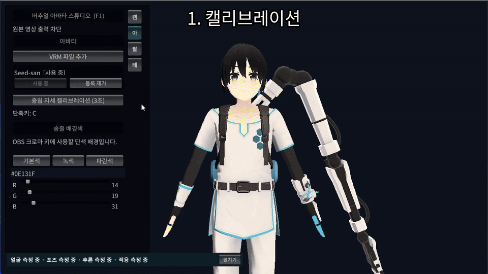
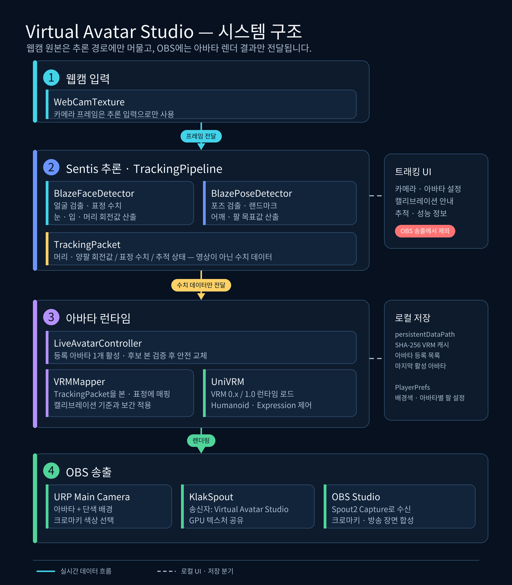
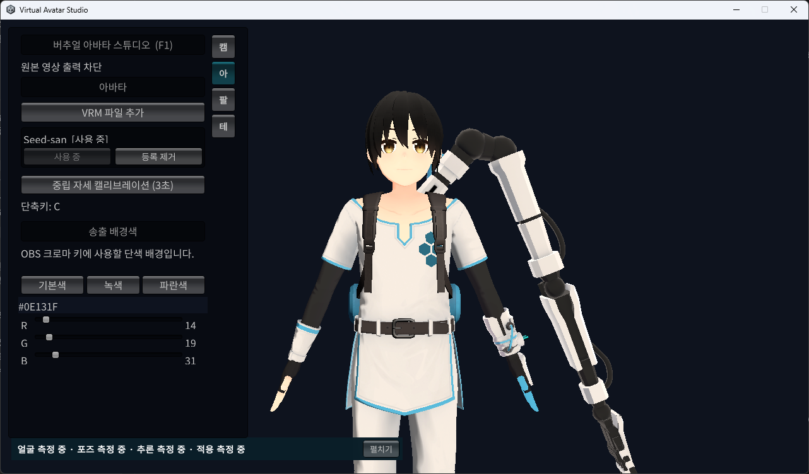
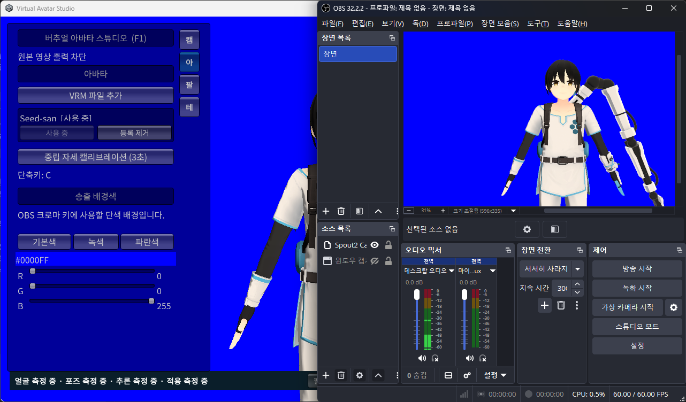
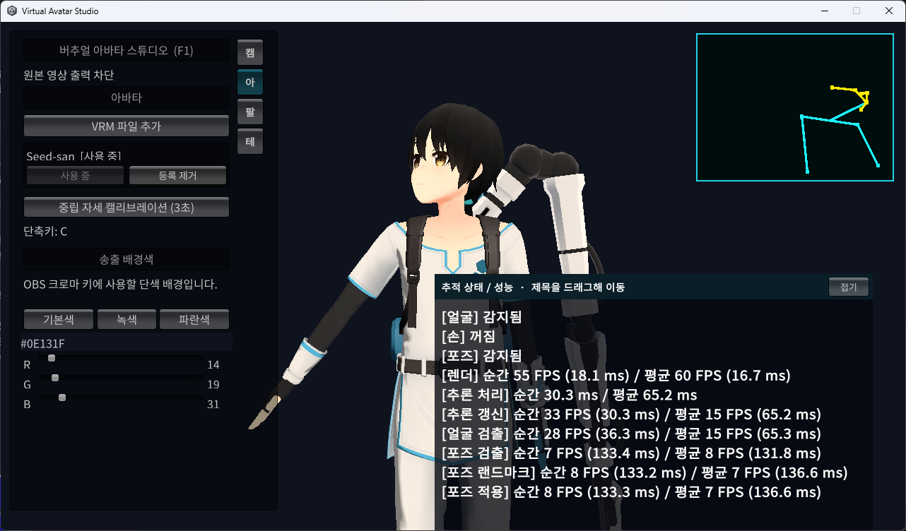

# Virtual Avatar Studio

Unity® 6와 Sentis를 사용해 웹캠에서 얼굴과 상체 포즈를 추론하고, VRM 아바타만 OBS로 전달하는 Windows용 버추얼 아바타 스튜디오입니다.

웹캠 원본을 방송 화면에 표시하지 않으면서 VRM 등록·캘리브레이션·크로마키 배경·Spout 송출까지 하나의 앱에서 운영하는 것을 목표로 제작했습니다.

[Windows x64 릴리즈 다운로드](../../releases/latest)



## 주요 기능

- BlazeFace·BlazePose 기반 얼굴 및 상체 포즈 추론
- VRM 0.x와 VRM 1.0 런타임 등록·전환·제거
- 숨겨진 후보 로드와 필수 휴머노이드 본 검증을 이용한 안전 교체
- 아바타별 중립 자세 캘리브레이션과 팔 매핑 설정
- 기본색·크로마 녹색·크로마 파란색 및 사용자 지정 RGB 배경
- KlakSpout을 이용한 OBS 아바타·배경 전용 송출
- 웹캠 원본과 트래킹 UI가 OBS 출력에 포함되지 않는 분리 구조
- 렌더·추론·검출·실제 포즈 적용 주기의 실시간 성능 계측
- 다중 VRM 등록, SHA-256 중복 방지와 마지막 활성 아바타 복원

## 시스템 구조

웹캠 프레임은 Sentis 추론 입력으로만 사용합니다. 추론이 끝나면 영상이 아닌 머리·팔 회전값, 표정 수치와 추적 상태를 `TrackingPacket`으로 전달합니다. Main Camera가 렌더링한 아바타와 단색 배경만 KlakSpout을 통해 OBS로 공유합니다.



## 실행 방법

### 준비 환경

- Windows 10/11 64비트
- 일반 USB 웹캠 또는 Windows 카메라 장치로 인식되는 웹캠
- Direct3D 11을 지원하는 GPU
- 사용할 권한이 있는 VRM 0.x 또는 VRM 1.0 파일
- OBS 송출 시 OBS Studio와 Windows용 Spout2 플러그인

### Windows 릴리즈

1. [GitHub Releases](../../releases/latest)에서 `Virtual Avatar Studio_1.0.zip`을 받습니다.
2. ZIP을 원하는 폴더에 완전히 압축 해제합니다.
3. `Virtual_Avatar_Studio.exe`를 실행합니다.
4. 아바타 페이지에서 `.vrm` 파일을 등록합니다. Virtual_Avatar_Studio.exe 창으로 파일을 끌어 놓아도 됩니다.
5. 카메라 페이지에서 웹캠을 선택하고 시작합니다.
6. 얼굴·양쪽 어깨·팔꿈치가 인식되면 `중립 자세 캘리브레이션 (3초)` 또는 `C` 키를 누릅니다.
7. 아바타 페이지에서 송출 배경색을 선택합니다.

실행 파일은 코드 서명이 적용되지 않아 Windows SmartScreen 경고가 나타날 수 있습니다. 압축 파일에는 기본 VRM이 포함되지 않습니다.

일반 UVC USB 웹캠은 Windows 카메라 장치로 인식되면 사용할 수 있습니다. 다른 프로그램이 같은 웹캠을 독점하고 있거나 Windows 개인정보 설정에서 데스크톱 앱의 카메라 접근이 꺼져 있으면 시작하지 못할 수 있습니다.

## VRM 등록과 캘리브레이션

아바타 등록 이력이 없는 최초 실행은 아바타 없이 시작합니다. 파일 탐색기나 Virtual_Avatar_Studio.exe 외부 드래그앤드롭으로 여러 VRM을 등록할 수 있지만, 렌더링과 메모리 사용량을 제한하기 위해 활성 아바타는 한 개만 유지합니다.

등록에 성공한 VRM은 앱 전용 로컬 캐시에 복사하고 SHA-256으로 중복 등록을 방지합니다. 새 아바타는 화면에 보이지 않는 후보 상태에서 파싱과 필수 본 검증을 통과한 뒤에만 기존 아바타와 교체됩니다. 등록 제거는 앱 전용 캐시와 등록 정보만 삭제하며 사용자가 선택한 원본 파일은 삭제하지 않습니다.

캘리브레이션할 때는 상체를 카메라 정면에 두고 양팔을 편안하게 내립니다. 손목과 손은 화면에 들어오지 않아도 됩니다. 인식 범위를 벗어나면 최대 5초간 복귀를 기다린 뒤 3초 카운트다운을 다시 시작합니다.



*VRM 등록 후 중립 자세 캘리브레이션을 진행하는 Windows 앱 화면*

### 예시 VRM 1.0

저장소와 릴리즈에는 기본 VRM을 포함하지 않습니다. 테스트 파일이 필요한 경우 VRM Consortium 공식 샘플인 Seed-san을 사용할 수 있습니다.

- [Seed-san 모델과 라이선스 안내](https://github.com/vrm-c/vrm-specification/tree/master/samples/Seed-san)
- [Seed-san.vrm 원본 다운로드](https://raw.githubusercontent.com/vrm-c/vrm-specification/master/samples/Seed-san/vrm/Seed-san.vrm)
- [VRM Public License 1.0](https://vrm.dev/licenses/1.0/)

모델을 사용하기 전에 원본 VRM에 포함된 이용 조건을 직접 확인해야 합니다.

## OBS 송출

1. [Spout2 Plugin for OBS](https://github.com/Off-World-Live/obs-spout2-plugin/releases)를 설치합니다.
2. OBS에서 `Spout 2 Capture` 소스를 추가합니다.
3. 송신자로 `Virtual Avatar Studio`를 선택합니다.
4. 녹색 또는 파란색 배경을 선택했다면 OBS 필터에서 크로마키를 적용합니다.
5. 소스 크기가 캔버스와 다르면 `변환 > 화면에 맞춤`을 실행합니다.

노트북처럼 내장 GPU와 외장 GPU가 함께 있는 환경에서는 Virtual Avatar Studio와 OBS를 Windows 그래픽 설정에서 같은 GPU로 지정해야 합니다. OBS에서는 Spout 출력을 사용하므로 동일 USB 웹캠을 별도의 `비디오 캡처 장치`로 열 필요가 없습니다.

Spout에는 Main Camera가 렌더링한 아바타와 배경만 전달됩니다. 카메라·아바타·팔·테스트 페이지, 캘리브레이션 안내, 성능 패널과 익명 추적 뼈대는 트래킹 UI에만 표시됩니다.



*Virtual Avatar Studio의 아바타·배경을 OBS Spout 소스로 수신한 화면*

## 기술적 해결 내용

### 추론 파이프라인 최적화

Windows Player에서 렌더는 평균 60 FPS였지만 추론 갱신이 평균 9 FPS로 떨어져 아바타가 끊겨 보였습니다. 포즈 검출기의 GPU 출력 세 개를 순차적으로 요청하던 방식을 모든 readback 요청을 먼저 시작한 뒤 각각 기다리는 구조로 변경했습니다. 추론 중 이미 렌더 프레임이 지난 경우 루프 말미의 불필요한 추가 프레임 대기도 제거했습니다.

검증 환경은 RTX 4080 Laptop GPU, Direct3D 11, USB 웹캠, 손 추적 비활성화 상태입니다.

| 항목 | 개선 전 | 개선 후 |
| --- | ---: | ---: |
| 렌더 평균 | 60 FPS | 60 FPS |
| 추론 처리 평균 | 98.3 ms | 62.9 ms |
| 추론 갱신 평균 | 9 FPS | 16 FPS |

개선 후 움직임이 부드러워졌음을 확인했습니다. 포즈 랜드마크와 실제 포즈 적용은 측정 당시 평균 6 FPS였으므로 추가 최적화 여지는 남아 있습니다.

### VRM 안전 교체와 자원 수명주기

- 새 VRM을 숨겨진 후보로 로드하고 검증 성공 시에만 활성 아바타 교체
- 파싱 실패·필수 본 누락 같은 확정 오류와 파일 잠김·접근 거부 같은 일시 오류 분리
- 후보 실패·교체·제거·종료 시 UniVRM 런타임을 먼저 동기 해제한 뒤 GameObject 파괴
- Editor 재컴파일과 Play Mode 종료를 포함한 SpringBone 네이티브 버퍼 정리 경로 통합
- 사용하지 않던 2D Animation 패키지를 제거해 Player 종료 시 fallback `ComputeBuffer` 경고 해소

### 성능 패널과 로그

성능 패널은 기본 한 줄 요약으로 접혀 있으며, 제목을 드래그해 이동할 수 있습니다. 펼치면 렌더, 전체 추론 처리·갱신, 얼굴 검출, 포즈 검출, 포즈 랜드마크와 실제 포즈 적용의 순간·EMA 평균을 확인할 수 있습니다.

카메라 변경·중지 또는 앱 정상 종료 시 같은 수치를 측정 구간당 한 번 `[TrackingPerformance]` 블록으로 기록합니다.

```text
%USERPROFILE%\AppData\LocalLow\Portfolio\Virtual Avatar Studio\Player.log
```



*드래그 이동을 지원하는 추적·성능 상세 패널*

## 개인정보 보호 설계

- 원본 `WebCamTexture`는 얼굴·포즈 추론 입력으로만 사용
- 트래킹 화면에는 원본 영상 대신 얼굴 랜드마크와 상체 뼈대만 표시
- 원본 카메라 프레임을 PNG·JPG 또는 영상 파일로 저장하는 경로 없음
- 선택적 UDP 출력은 영상이 아닌 회전·표정 수치만 전송하며 기본 비활성화
- Spout 초기화 실패 시 웹캠이 포함될 수 있는 Game View 캡처로 자동 전환하지 않음

## 팔 매핑과 진단

<details>
<summary>아바타별 팔 매핑 설정</summary>

1. `뼈 단독 테스트 모드 사용`을 켜고 중립·T 포즈·양팔 올림으로 VRM 팔 본 방향을 확인합니다.
2. 필요하면 왼팔·오른팔 중립 Z축을 조정합니다.
3. 테스트 모드를 끄고 웹캠을 시작한 뒤 중립 자세를 다시 캘리브레이션합니다.
4. 반대쪽 팔이 움직이면 좌우 입력 교환을 사용합니다.
5. 움직임 방향이 반대면 해당 팔 방향 반전을 사용합니다.
6. 이득, 최대 변화량, 입력 평활화와 최대 입력 점프를 아바타에 맞게 조정합니다.

팔 설정과 최근 검증 결과는 등록 아바타별로 분리해 저장됩니다.

</details>

<details>
<summary>팔 동작 검증</summary>

캘리브레이션을 완료하고 뼈 단독 테스트를 끈 뒤 테스트 페이지에서 팔 동작 검증을 실행합니다. 검사는 중립 자세, 왼팔 들기, 다시 중립 자세, 오른팔 들기 순서로 진행합니다. 좌우 반응, 각도 경계 안정성, 출력 급변, 거부된 이상 입력과 포즈 유실 시간을 기준으로 결과를 표시합니다.

</details>

## 개발 환경과 소스 실행

| 구성 | 버전 |
| --- | --- |
| Unity | 6000.3.10f1 |
| Universal Render Pipeline | 17.3.0 |
| Sentis / Unity Inference Engine | 2.5.0 |
| UniVRM | 0.131.0 |
| KlakSpout | 2.0.6 |
| UniTask | 2.5.10 |

공개 저장소에는 제3자 ONNX 바이너리를 포함하지 않습니다. [Unity Technologies Sentis Blaze Detection Sample](https://github.com/Unity-Technologies/sentis-samples/tree/main/BlazeDetectionSample)에서 다음 파일을 받아 `Assets/Models`에 배치해야 합니다.

- `blaze_face_short_range.onnx`
- `hand_detector.onnx`
- `hand_landmarks_detector.onnx`
- `pose_detection.onnx`
- `pose_landmarks_detector_full.onnx`

Unity에서 프로젝트를 연 뒤 `Assets/Scenes/SampleScene.unity`를 실행합니다. Windows 빌드는 Unity 메뉴의 `VAS > 빌드 > Windows x64 방송 빌드`를 사용합니다. 빌드 전후 검사에서 `.vrm`이 발견되면 결과물을 제거하고 실패 처리합니다.

Unity batchmode는 이 프로젝트의 현재 권장 빌드 경로가 아닙니다.

## 폴더 구성

- `Assets/VAS/Tracking`: 웹캠 수명주기, Sentis 추론과 성능 계측
- `Assets/VAS/Avatar`: VRM 등록 저장소와 안전 교체 제어
- `Assets/VAS/Platform`: Windows 파일 선택과 외부 드롭 연동
- `Assets/VAS/Mapping`: 추적 결과와 아바타 매핑
- `Assets/VAS/Network`: 선택적 수치 데이터 UDP 출력
- `Assets/VAS/Resources/Fonts`: 한글 런타임 UI 폰트와 라이선스
- `Assets/PC`: VRM 본·표정 매핑
- `Assets/Models`: 로컬 ONNX 모델
- `Assets/Shared`: 공용 추적 데이터와 필터
- `Docs/Media`: README 데모와 시스템 구조도
- `LocalOnly/Avatars`: Git과 빌드에서 제외되는 로컬 VRM 보관 위치

## 검증 범위

- Editor Play Mode와 Windows Player의 VRM 0.x·1.0 등록 및 전환
- 한글과 공백이 포함된 경로의 파일 탐색기 등록
- Windows Player 외부 드래그앤드롭 등록
- 중복 등록 방지, 현재·비활성 아바타 제거와 재실행 복원
- 캘리브레이션 인식 이탈·복귀 및 팔 매핑·검증
- 선택한 배경색 유지와 OBS 크로마키
- OBS에서 트래킹 UI·웹캠 원본 비노출
- 반복 교체와 정상 종료 시 네이티브 자원 경고·예외 부재
- Windows x64 빌드 결과의 `.vrm` 파일 0개

## 라이선스와 출처

프로젝트는 Unity Technologies의 Sentis 샘플을 기준으로 Blaze 얼굴·손·포즈 추론 구조를 구현했습니다. 모델과 라이브러리를 포함한 제3자 구성요소의 출처와 조건은 [THIRD_PARTY_NOTICES.md](THIRD_PARTY_NOTICES.md)를 확인하십시오.

- [Sentis Samples](https://github.com/Unity-Technologies/sentis-samples)
- [UniVRM](https://github.com/vrm-c/UniVRM)
- [KlakSpout](https://github.com/keijiro/KlakSpout)
- [OBS Spout2 Plugin](https://github.com/Off-World-Live/obs-spout2-plugin)
- [Noto CJK](https://github.com/notofonts/noto-cjk)

## 상표 고지

Virtual Avatar Studio was made with Unity®. Unity is a trademark or registered trademark of Unity Technologies.

Copyright © 2005–2026 Unity Technologies. All rights reserved.
